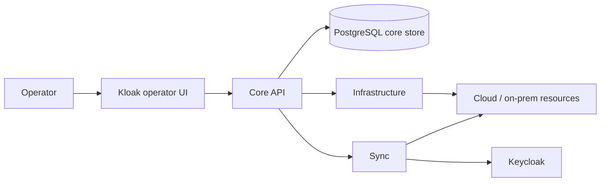

# First implementation slice

This scaffold turns the product model into code. The goal is to keep the first pass small, testable, and aligned with the decisions already recorded in `CONTEXT.md` and `docs/adr/0001-opinionated-auth-appliance.md`.

## Topology

The first version should keep the admin API, sync loop, and infrastructure provisioning separate so each piece can be tested on its own.

## Core data model

These are the first concepts to encode in the core:

- `Deployment` - one isolated customer deployment and its lifecycle state.
- `DeploymentVersion` - an immutable release of a deployment that can be rolled forward.
- `DesiredStateSnapshot` - the versioned state Kloak wants the live stack to match.
- `ReconciliationRun` - one attempt to compare desired and live state and repair drift.
- `DriftFinding` - a mismatch between desired state and live Keycloak or infrastructure state.
- `ProvisioningTarget` - the cloud account, project, or on-prem target that receives a deployment.
- `AuditEvent` - an operator-visible record of important actions and repairs.

## First reconciliation loop

The first sync loop should do only four things:

1. Load the current desired state for one deployment.
2. Read live Keycloak state and the relevant infrastructure state.
3. Diff live state against desired state and decide what needs repair.
4. Apply the whole auth object end-to-end, then verify and record the result.

If reconciliation fails, the system should persist the failure, surface the drift, and leave the deployment in a retryable state.

## Initial code seams

### Core
Owns the persisted deployment model and lifecycle state.

### Sync
Owns drift detection, repair orchestration, and post-apply verification.

### Infrastructure
Owns creation and maintenance of deployment accounts, projects, ingress, DNS, secrets, and other platform dependencies.

### Admin UI
Owns the workflow for provisioning, viewing drift, approving exceptional actions, and reviewing deployment history.

## Build order

1. Define the core schema and persistence layer.
2. Define the sync interface and a fake Keycloak adapter.
3. Define the infrastructure interface and one target implementation.
4. Wire the admin UI to the core API.
